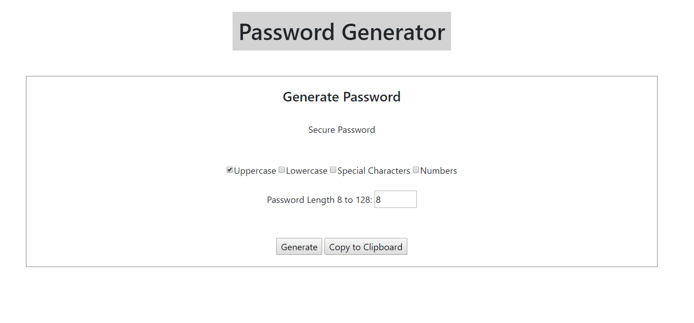

# javascript_homework_3
Random Password Generator 

https://westonbmeier.github.io/javascript_homework_3/

## 
This is a Password Generator using uppercase letters, lowercase letters, numbers and symbols to generate secure password. 
There is an option available to copy the generated password to the clipboard. 

The interface is supposed to be represent a retro looking theme. The simplicity of the styling is inspired by what I imagine what it would have looked like if I was coding when the first iterations of these languages were being used. 

Screenshot: 

